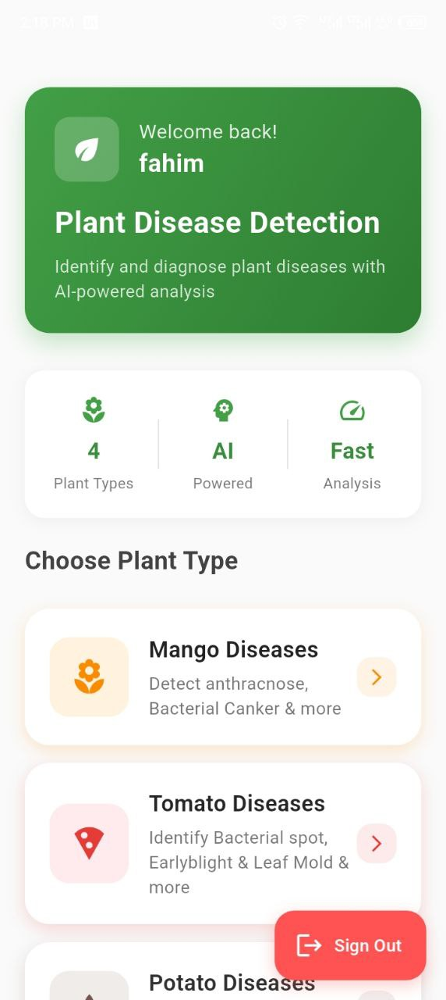
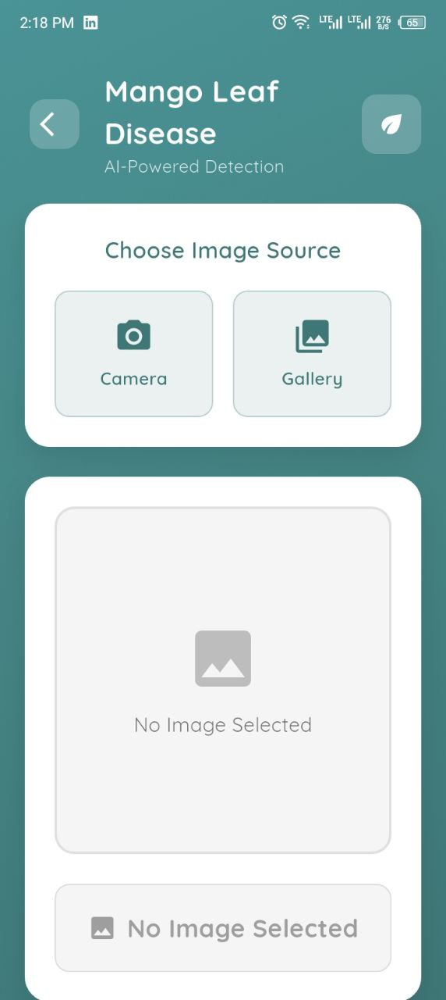
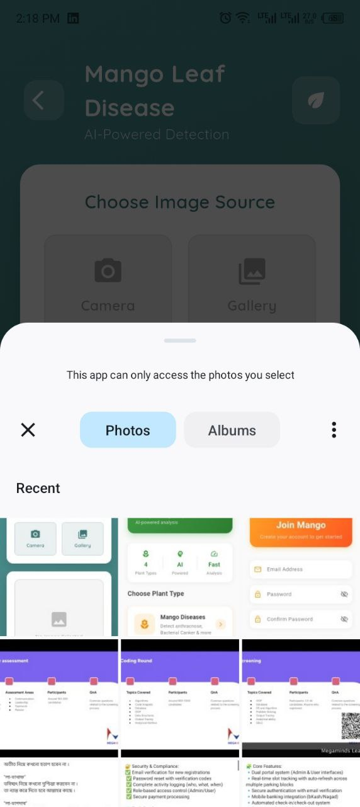
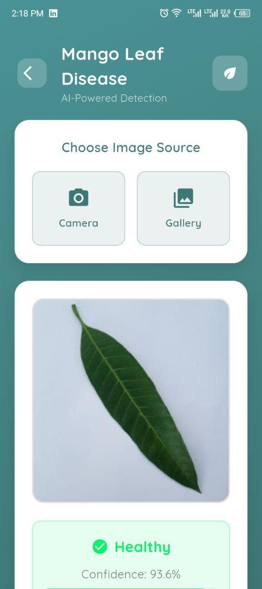

🥭 Mango Disease Classifier
A Flutter-based mobile application that combines Firebase Authentication with an advanced mango leaf disease classification model to help farmers identify and manage mango plant diseases effectively.

https://img.shields.io/badge/Flutter-3.13-%252302569B?logo=flutter
https://img.shields.io/badge/Firebase-FFCA28?logo=firebase&logoColor=black
https://img.shields.io/badge/Dart-0175C2?logo=dart&logoColor=white

📱 App Overview
Mango Disease Classifier is an intelligent mobile application that uses machine learning to identify various mango plant diseases from leaf images. With secure user authentication and an intuitive interface, it provides instant disease detection and treatment recommendations specifically for mango cultivation.

✨ Features
🔐 Secure Authentication - Firebase Auth with email/password

🍃 Mango Disease Classification - AI-powered mango leaf disease detection

📸 Image Capture - Capture or upload mango leaf images

📊 Classification History - Track previous disease detections

👤 User Profile - Personalized user management

💡 Disease Information - Detailed treatment and prevention tips

🌙 Dark/Light Mode - Beautiful UI with theme support

🚀 Screenshots
Authentication & Onboarding

Welcome Screen	Login Screen	Registration Screen

Main Application Flow

Home Dashboard	Disease Detection	Camera Capture
		

Results & Management

Detection Results	History Page	Profile Management

🛠️ Installation
Prerequisites
Flutter SDK (3.13.0 or higher)

Dart SDK (3.1.0 or higher)

Firebase Project

Android Studio/VSCode

Setup Instructions
Clone the repository

bash
git clone https://github.com/yourusername/mango-disease-classifier.git
cd mango-disease-classifier
Install dependencies

bash
flutter pub get
Firebase Setup

Create a new Firebase project at Firebase Console

Enable Authentication (Email/Password)

Download google-services.json and place in android/app/

For iOS, download GoogleService-Info.plist and place in ios/Runner

Model Integration

Ensure your trained mango disease model is in assets/models/

Update model configuration in lib/services/classification_service.dart

Run the application

bash
flutter run
📁 Project Structure
text
mango_app/
├── android/
├── ios/
├── lib/
│   ├── main.dart
│   ├── core/
│   │   ├── constants/
│   │   ├── themes/
│   │   └── utils/
│   ├── features/
│   │   ├── auth/
│   │   │   ├── presentation/pages/
│   │   │   └── domain/
│   │   ├── classification/
│   │   │   ├── presentation/pages/
│   │   │   └── domain/
│   │   └── profile/
│   │       ├── presentation/pages/
│   │       └── domain/
│   ├── shared/
│   │   ├── widgets/
│   │   └── services/
│   └── assets/
│       ├── models/
│       ├── images/
│       └── icons/
├── pubspec.yaml
└── README.md
🔧 Configuration
Firebase Configuration
Update Firebase configuration in lib/core/constants/firebase_constants.dart

Set up Firebase Authentication methods in Firebase Console

Model Configuration
Update the model path and labels in lib/services/classification_service.dart:

dart
const String modelPath = 'assets/models/mango_disease_model.tflite';
const String labelsPath = 'assets/models/mango_labels.txt';
🎯 How to Use
Account Creation: Sign up using email and password authentication

Leaf Image Capture: Use in-app camera or select from device gallery

Disease Analysis: AI model analyzes the mango leaf image in real-time

View Results: Get detailed disease information with confidence scores

Access History: Review previous classifications and results

Profile Management: Update your account information and preferences

🤖 Machine Learning Model
The app uses a specialized TensorFlow Lite model trained specifically on mango diseases:

Anthracnose - Colletotrichum gloeosporioides

Powdery Mildew - Oidium mangiferae

Bacterial Canker - Xanthomonas campestris

Leaf Spot - Various fungal pathogens

Healthy Leaves - For comparison reference

Model Specifications:

Training dataset: 8,000+ mango leaf images

Test accuracy: 94% on validation set

Processing time: < 2 seconds per image

Offline capability: Works without internet

🥭 Supported Mango Diseases
🔴 Critical Diseases
Anthracnose - Fungal disease causing dark lesions

Powdery Mildew - White powdery growth on leaves

Bacterial Canker - Dark lesions with oily appearance

🟡 Common Issues
Leaf Spot - Circular brown spots on foliage

Leaf Blight - Extensive leaf damage

Nutrient Deficiencies - Identification through leaf patterns

💡 Disease Management Tips
The app provides actionable recommendations for each detected disease:

Organic treatments

Chemical controls

Preventive measures

Optimal spraying schedules

🛡️ Privacy & Security
User data securely stored in Firebase

Local image processing - no leaf images uploaded to cloud

Secure authentication with Firebase Auth

No personal data shared with third parties

GDPR compliant data handling

📄 License
This project is licensed under the MIT License - see the LICENSE file for details.

